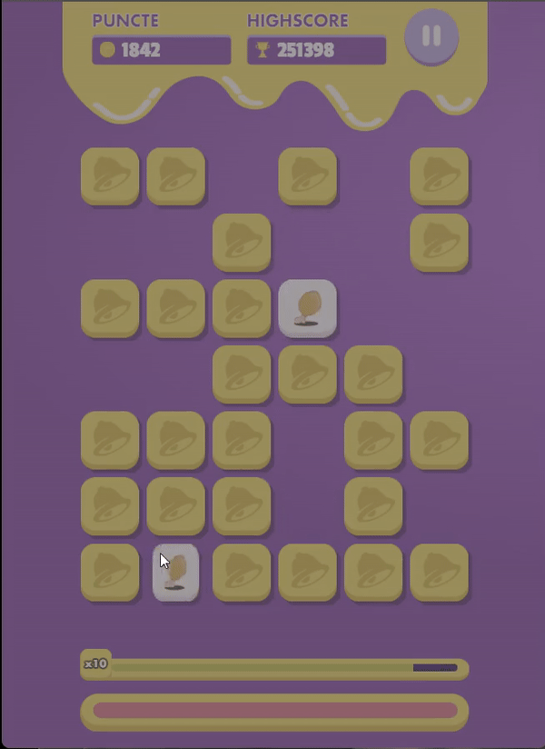
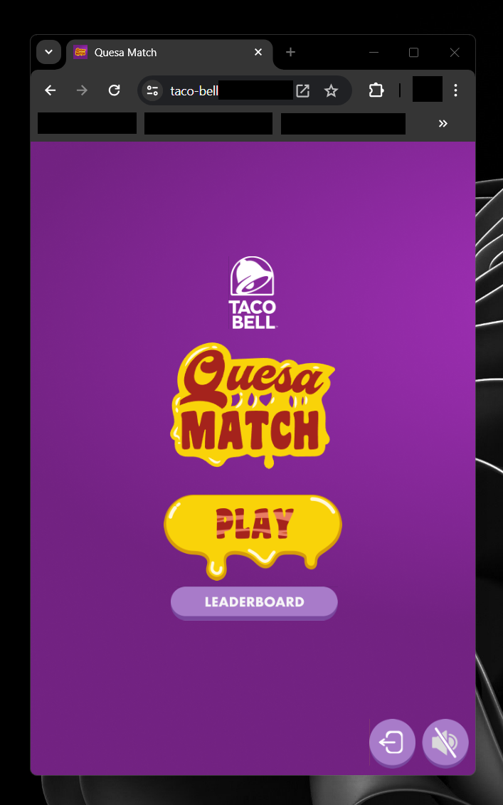
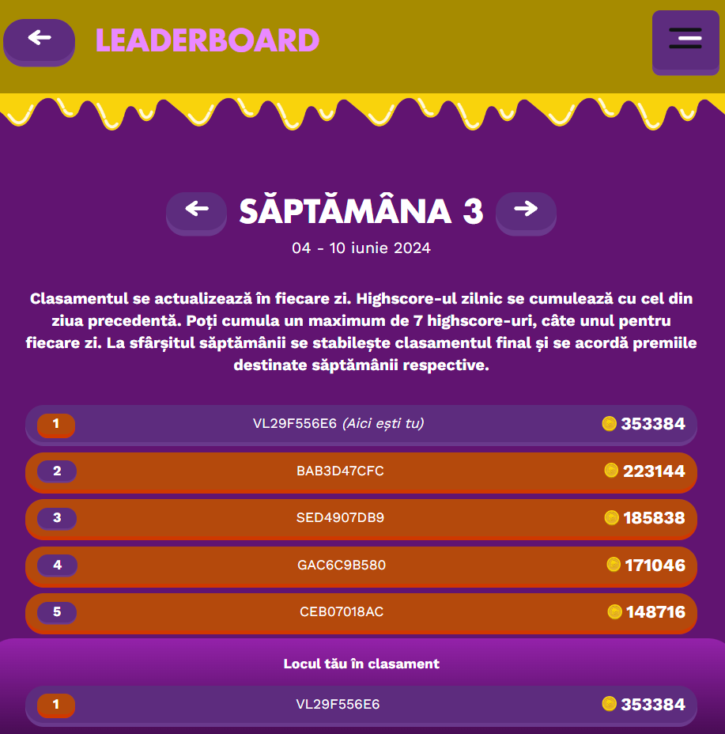

# quesa-match-bot

This bot was designed to help you get a high score in Taco Bell's Quesa Match game. It uses Python's open-cv & Pillow libraries for image detection & UI coordinates calculation & pyautogui for key presses.



## Table of Contents

- [Installation](#installation)
- [Usage](#usage)
- [Contributing](#contributing)

## Installation

### Prerequisites

- Python (>= 3.10.x)
- GitHub account

### Steps

1. Clone the repository:
    ```sh
    git clone https://github.com/VladGhelbere/quesa-match-bot.git
    cd quesa-match-bot
    ```

2. Install dependencies:
    ```sh
    pip install -r requirements.txt
    ```

## Usage

You can start the bot by simply running:
```sh
python quesa-match-bot.py
```
For the bot to work properly you'll need to find the right game window size.

1. To find the right game window size for your screen, follow these steps:
- Play manually until the game grid becomes at least 5x6 cards.
- Resize the window (doesn't matter what stage the game is at) until you see the text appear in the console: "Start image found on screen. Proceeding with the game..."
Your window should have the ratio of a phone screen and should look something like this:

- After this, you can finish the current stage manually and then the bot will take over.

2. After your window has been resized & your game is recognized correctly, wait for the bot to solve the puzzles one after another.

3. After you stop the bot make sure to brag to all your friends about your highscore.


## Contributing
Contributions are always welcome !
Just create your own branch & open a pull request.